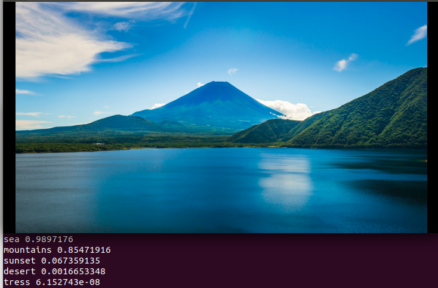

## Multilabel-Classification-Classify-scenes-from-the-images

This project use TensorFlow Hub to ingest pre-trained pieces of models it provides modules, which are pre-trained pieces of TensorFlow models that can be reused on new tasks.Using pretrained networks one can train network very fast since model is already learnt many 
parameters.
Here **[retrain.py](https://github.com/tensorflow/hub/blob/master/examples/image_retraining/retrain.py)** is modfied to handle Multiple labels associated with images.

### Installation
Packages required to run this project is given in *requirement.txt* file.

### Steps to follow to train the model
1) Dataset Preparation :

All the images should be kept in *images* folder.Along with the images you will need to create **dataset_train.lst** for training data and **dataset_test.lst** for testing dataset.In this project 80% of data used in training and 20% data used in testing. Arrange files in following manner
```bash
/DATASET
-dataset_train.lst
-dataset_test.lst
-/images
-- 1.jpg
-- 2.jpg
-- 3.jpg
```
#### Format of lst files
It should contain a unique image index, followed by a tab-separated list of binary flags for each label (1 to indicate label exists in image, and 0 to indicate label doesn't exist), followed by a path to the image.
Here I converted **labels.json** file into required format using **data_generation.py** python file.This will give **dataset.lst** file.
Shuffle this labels using ```bash python shuf dataset.lst```.Divide data inside that file into **dataset_train.lst** and **dataset_test.lst**.

2) Training :
Create folders *MODEL_DETAILS* and *MODEL* in the same directory.
Here final activation function(final_tensor) will be *sigmoid*(since we have labels between 0 and 1) but in the original **[retrain.py](https://github.com/tensorflow/hub/blob/master/examples/image_retraining/retrain.py)** final activation(final_tensor) is *softmax*(since labels values can be between 0-1000 for ImageNet)
Training is done using **mobilenet_v2_100_224** using feature vector module from TensorFlow Hub.
Traning is done for around *100 epochs*.Testing accuracy is **90%**.Model size is around **9MB**.

To train the model run the below command:
```bash
python retrain.py \
--image_dir ./DATASET/ \
--tfhub_module https://tfhub.dev/google/imagenet/mobilenet_v2_100_224/feature_vector/2 \
--num_classes=5
```

3) Testing :

After training model graph saved into *MODEL_DETAILS/output_graph.pb* this graph contains weights specific to our training.
Here output will always be the vector of probablities of length equal to number of classes present image(in this application we have 5 
classes per image) so output will be always 1x5 row matrix.

To train the model run the below command:
```bash
python label_image.py \
--image=test.jpeg
```


